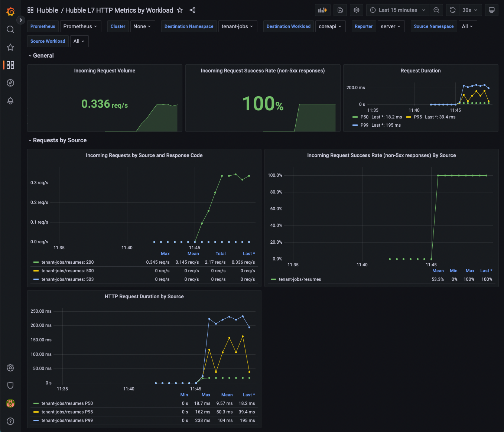
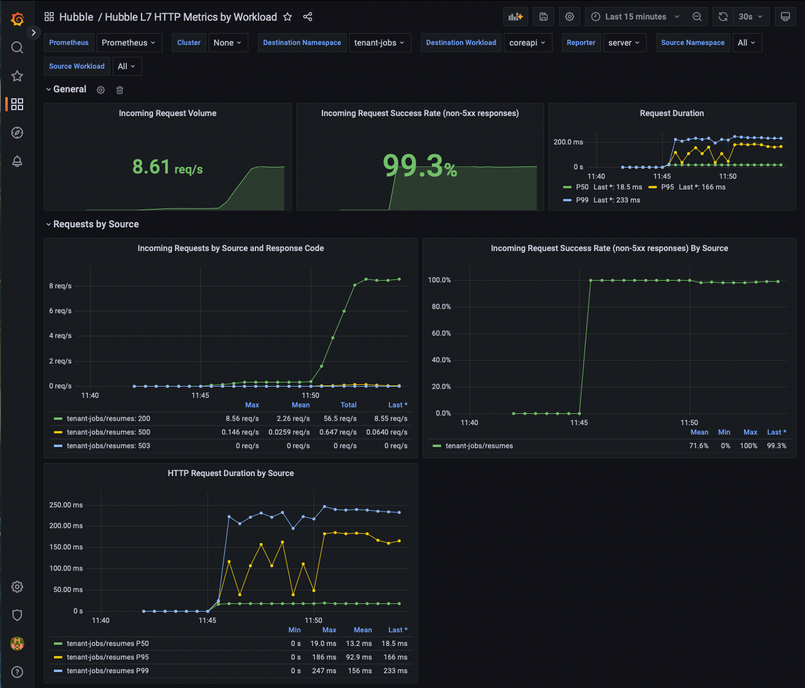
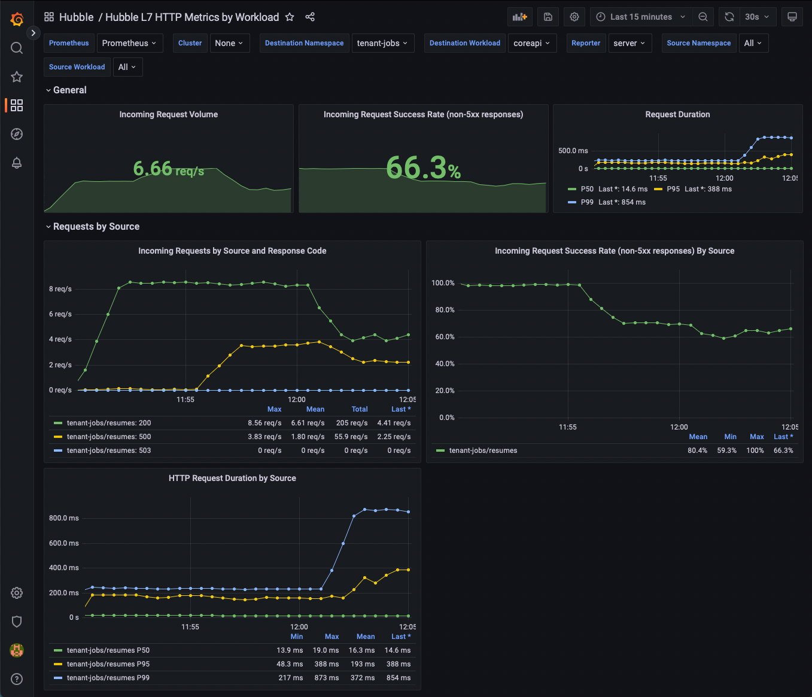
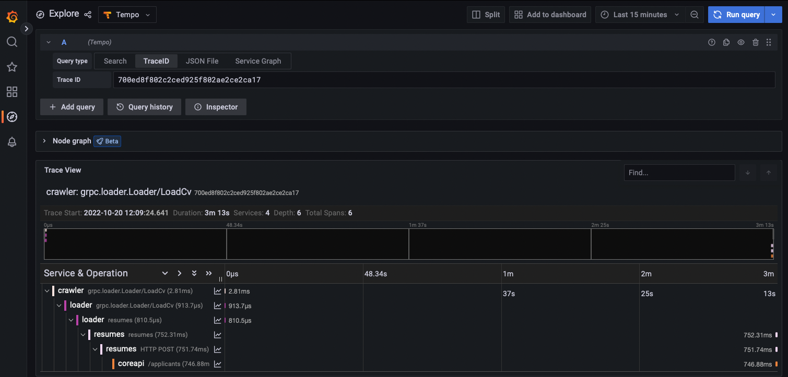
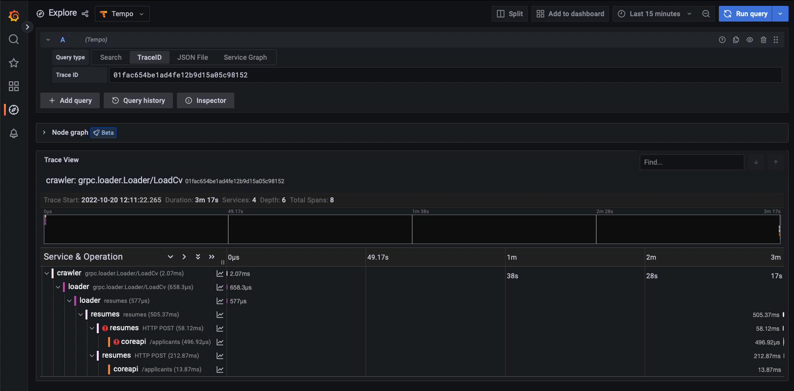

# Cilium Grafana Observability Demo

One of the most important things when running applications in an environment like Kubernetes is to have good observability and deep insights.
However, for many organizations it can be challenging to update existing applications to provide the observability you want.
With Cilium, you can use the Hubble L7 visibility functionality to get Prometheus metrics for your application without having to modify it at all.

In this demo you will be deploying Cilium along with Grafana and Prometheus to demonstrate how Cilium can provide metrics for an existing application without metrics functionality, and how you can use Grafana dashboards provided by Cilium to gain insight into how your application is behaving.

## Prerequisites

You will need the following tools installed before proceeding:

- [git](https://git-scm.com/book/en/v2/Getting-Started-Installing-Git)
- [helm](https://helm.sh/docs/intro/install/)
- [kind](https://kind.sigs.k8s.io/docs/user/quick-start/)
- [yq](https://github.com/mikefarah/yq/#install)
- [kubectl](https://kubernetes.io/docs/tasks/tools/)
- [cilium-cli](https://docs.cilium.io/en/stable/gettingstarted/k8s-install-default/#install-the-cilium-cli)

## Setup

Before running the following commands, ensure the repository has been cloned locally:

```bash
git clone https://github.com/isovalent/cilium-grafana-observability-demo
```

We're going to use [KIND](https://kind.sigs.k8s.io) to setup our Kubernetes cluster.
All you need is access to a host running Docker.

This will create a KIND cluster without the default CNI so we can use cilium:

```bash
kind create cluster --config kind-config.yaml
```

Next we need to add a few helm repos:

```bash
helm repo add cilium https://helm.cilium.io
helm repo add ingress-nginx https://kubernetes.github.io/ingress-nginx
helm repo add prometheus-community https://prometheus-community.github.io/helm-charts
helm repo add open-telemetry https://open-telemetry.github.io/opentelemetry-helm-charts
helm repo add minio https://operator.min.io
helm repo add grafana https://grafana.github.io/helm-charts
helm repo add strimzi https://strimzi.io/charts
helm repo add elastic https://helm.elastic.co
```

And we're going to install the Prometheus-operator CRDs before cilium, to avoid issues installing the Cilium ServiceMonitor:

```bash
helm template kube-prometheus prometheus-community/kube-prometheus-stack --include-crds \
  | yq 'select(.kind == "CustomResourceDefinition") * {"metadata": {"annotations": {"meta.helm.sh/release-name": "kube-prometheus", "meta.helm.sh/release-namespace": "monitoring"}}}' \
  | kubectl create -f -
```

Additionally, we're going to create the monitoring namespace ahead of time, which is where Cilium will install the Hubble Grafana dashboards:

```bash
kubectl create ns monitoring
```

## Deployment

In this demo, we will be deploying Cilium, Ingress-nginx, Prometheus, Tempo, and Grafana.
Afterwards we will install the Isovalent "jobs-app" for demoing the Hubble HTTP metrics.

### Cilium Install

Next, let's install Cilium:

```bash
# masterIP is needed for kubeProxyReplacement
MASTER_IP="$(docker inspect kind-control-plane | jq '.[0].NetworkSettings.Networks.kind.IPAddress' -r)"
helm upgrade cilium cilium/cilium \
  --version 1.13.0-rc2 \
  --install \
  --wait \
  --namespace kube-system \
  --values helm/cilium-values.yaml \
  --set kubeProxyReplacement=strict \
  --set k8sServiceHost="${MASTER_IP}" \
  --set k8sServicePort=6443
```

Next, check the pods, and run the `cilium status` once everything is `Running`:

```bash
kubectl get pods -n kube-system
cilium status --wait
```

### ingress-nginx install

We use ingress-nginx to access Grafana.

```bash
helm upgrade ingress-nginx ingress-nginx/ingress-nginx \
  --install \
  --wait \
  --namespace ingress-nginx --create-namespace \
  --version 4.1.3 \
  --values helm/ingress-nginx-values.yaml
```

### OpenTelemetry operator and collector

This will be how we send traces to Tempo

```bash
helm upgrade opentelemetry-operator open-telemetry/opentelemetry-operator \
  --install \
  --wait \
  --namespace opentelemetry-operator --create-namespace \
  --version 0.15.0 \
  -f helm/opentelemetry-operator-values.yaml
kubectl apply -n opentelemetry-operator -f manifests/otel-collector.yaml
```

### Tempo install

Tempo will receive our traces from the OTEL collector.

```bash
helm upgrade tempo grafana/tempo \
  --install \
  --wait \
  --namespace tempo --create-namespace \
  --create-namespace \
  --version 0.16.2 \
  -f helm/tempo-values.yaml
```

### Prometheus & Grafana install

Prometheus will be used for collecting and storing the metrics produced by Hubble and Grafana will be used to visualize the metrics.

```bash
helm upgrade kube-prometheus prometheus-community/kube-prometheus-stack \
   --install \
   --wait \
   --namespace monitoring --create-namespace \
   --version 40.3.1 \
   --values helm/prometheus-values.yaml
```

Now you should be able to visit Grafana in your browser at <http://grafana.127-0-0-1.sslip.io> with the username `admin`, password `password`.

> **Note**
> If you're running Kind on a virtual machine in the public cloud, you can use port forwarding to access this URL from your local browser.  For example, on GCP `gcloud compute ssh --ssh-flag="-L 30080:localhost:80" --zone "<zone>" "<VM instance>"` will allow you to access this Grafana instance at <http://grafana.127-0-0-1.sslip.io:30080> in your web browser

### jobs-app install

Next we're going to deploy the jobs-app which includes a L7 CiliumNetworkPolicy so Hubble will generate metrics based on the HTTP flows, and some optional support for for tracing.

```bash
helm dep build ./helm/jobs-app
helm upgrade jobs-app ./helm/jobs-app \
  --install \
  --wait \
  --create-namespace \
  --namespace tenant-jobs \
  -f helm/jobs-app-values.yaml
```

To view the CiliumNetworkPolicy run:

```bash
kubectl get ciliumnetworkpolicy -n tenant-jobs -o yaml
```

## Demo

Before we get too far, let's go over the different components:

- `coreapi` is a RESTFUL HTTP main API used by the resumes, recruiter, and jobposting components. It manages creating, retrieving and listing resumes and jobpostings from Elasticsearch.
- `crawler` will periodically generate random resumes and sends them to `loader` via gRPC.
- `loader` is a gRPC service which submits resumes into the `resumes` kafka topic to be processed by the `resumes` component.
- `resumes` subscribes to the `resumes` kafka topic, and submits the resumes to the `coreapi`, which stores them in Elasticsearch.
- `elasticsearch` stores resumes, job postings, and analytics.
- `kafka` takes resumes in from `loader` in the `resumes` topic.
- `jobposting` Uses the `coreapi` to lists job postings on a web UI and allows applicants to submit their resumes.
- `recruiter` Uses the `coreapi` to list applicants and allows you to view their resumes.

First, open [Grafana and the Hubble L7 HTTP metrics By Workload dashboard][grafana-dashboard].

You should start to see some metrics being populated.



Everything in the dashboard is using the Hubble HTTP metrics, without any instrumentation required from the application, and without any being injected into the applicantion.

From the dashboard, find the `Destination Workload` variable at the top of the page, and select `loader`.

Next, lets increase the request volume by configuring crawler to generate more resumes and by running more than 1 replica of the crawler:

```bash
helm upgrade jobs-app ./helm/jobs-app --namespace tenant-jobs --reuse-values -f helm/jobs-app-increased-request-rate.yaml
```

Now go back into [Grafana][grafana-dashboard].
You should see the request rate increase as a result of the increased resume generation rates by crawler.


Now go back to the `Destination Workload` variable at the top of the page, and select `coreapi`.
You should see the request rate increase for `coreapi` as well.



Next, let's deploy a new configuration of our app and use our metrics to see the change in the request error rate.

```bash
helm upgrade jobs-app ./helm/jobs-app --namespace tenant-jobs --reuse-values -f helm/jobs-app-increased-error-rate.yaml
```

Now go back into [Grafana][grafana-dashboard].
You should see the error rate increase as a result of coreapi configuration changing.


Next, let's deploy a new configuration of our app and use our metrics to see the change in the request duration.

```bash
helm upgrade jobs-app ./helm/jobs-app --namespace tenant-jobs --reuse-values -f helm/jobs-app-increased-request-duration.yaml
```

Now go back into [Grafana][grafana-dashboard].
You should see the request durations increase as a result of coreapi configuration changing.



### Tracing integration

If your application exports tracing headers, Hubble can be configured to extract these trace IDs from http headers and export them with the Hubble HTTP metrics as [Exemplars](https://grafana.com/docs/grafana/v9.0/basics/exemplars/) which allow us to link from metrics to traces in Grafana.

As it happens, the jobs-app has support for creating traces using [OpenTelemetry](https://opentelemetry.io).

Next, let's deploy the jobs-app with tracing enabled:

```bash
helm upgrade jobs-app ./helm/jobs-app --namespace tenant-jobs --reuse-values -f helm/jobs-app-enable-tracing.yaml
```

Now go back into [Grafana][grafana-dashboard].
In the HTTP Request Duration by Source/Destination panels, you should start to see the exemplars showing up as dots alongside the line graph visualizations.
Each one of these exemplars represents the duration of a single request and links to a trace ID.


If you mouse over an examplar in Grafana, you will see metadata about the metric, and one of these fields should be `traceID` and should have a link you can click on to view the trace in Tempo.


Go ahead and find some exemplars and open them in Tempo.
You should see that some requests are slower than others and some of the requests fail and get retried by the clients.

A trace where everything was successful:



A trace where a request failed and was retried and succeeded the second time:



In summary, by using Cilium's L7 network policies you can get insight into how your application is behaving without any changes to the application, and without any sidecars.
Additionally, if your application already supports distributed tracing, Cilium enhances it by integrating traces with Hubble flows.

[grafana-dashboard]: http://grafana.127-0-0-1.sslip.io/d/3g264CZVz/hubble-l7-http-metrics-by-workload?orgId=1&refresh=30s&var-DS_PROMETHEUS=Prometheus&var-cluster=&var-destination_namespace=tenant-jobs&var-destination_workload=coreapi&var-reporter=server&var-source_namespace=All&var-source_workload=All&from=now-15m&to=now
